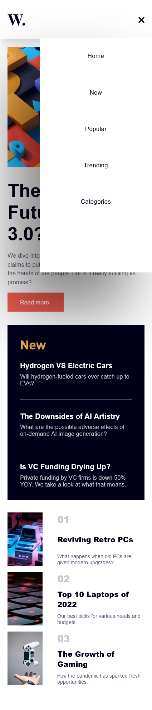
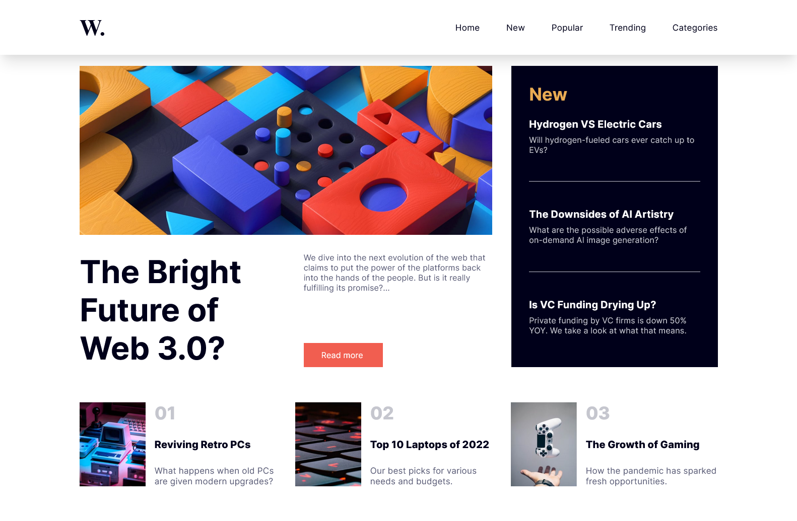
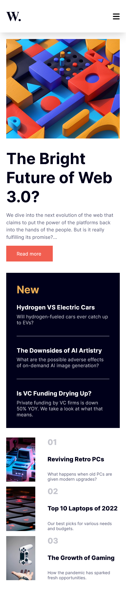

# Frontend Mentor - News homepage solution

This is a solution to the [News homepage challenge on Frontend Mentor](https://www.frontendmentor.io/challenges/news-homepage-H6SWTa1MFl). Frontend Mentor challenges help you improve your coding skills by building realistic projects. 

## Table of contents

- [Overview](#overview)
  - [The challenge](#the-challenge)
  - [Screenshot](#screenshot)
  - [Links](#links)
- [My process](#my-process)
  - [Built with](#built-with)
  - [What I learned](#what-i-learned)
  - [Continued development](#continued-development)
- [Author](#author)

## Overview

### The challenge

Users should be able to:

- View the optimal layout for the interface depending on their device's screen size
- See hover and focus states for all interactive elements on the page

### Screenshot

### Links

- Solution URL: [https://github.com/Iamjomani/newshomepage]
- Live Site URL: [https://iamjomani.github.io/newshomepage/]

## My process

### Built with

- Semantic HTML5 markup
- CSS custom properties
- Flexbox
- CSS Grid
- vanila javascript

### What I learned

1. I learned how to create mobile hamburger menu
2. I learned more about how css flex-box and grid works.
3. I gained more insight to moblie responsiveness and layout optimization
4. media queries
5. github pages

### Continued development

I want to build on my knowledge of grid so i can create complex responsive layout. 
I want to also focus on my problem solving skills so i can figure out the best utility to achieve my layout to make it responsive without having to hack and fix everything as well as reduce the number of breakpoints and media queries i need .

## Author

- Website - [Jomani Enahoro](https://www.your-site.com)
- Frontend Mentor - [@iamjomani](https://www.frontendmentor.io/profile/yourusername)
- Twitter - [@iam_jomani](https://www.twitter.com/iam_jomani)

